<!-- ──────────────────────────────────────────────────────────────────────
     Os tres SVGs sao gerados pelos scripts em ./scripts (veja SETUP.md).
     O heatmap e o cartao de stats se atualizam sozinhos todo dia pelo
     workflow .github/workflows/update-profile-art.yml
     ────────────────────────────────────────────────────────────────── -->

<h3><code>gabriel@github ~ $ ./contributions.sh</code></h3>

 
 

<!-- os dois SVGs tem 840x880, entao larguras iguais dao alturas iguais -->

<h3><code>gabriel@github ~ $ whoami</code></h3>

<table>
<tr>
<td valign="top"></td>
<td valign="top"></td>
</tr>
</table>

 
 

<h3><code>gabriel@github ~ $ ./links.sh</code></h3>

<b>Data Communication Analyst &amp; Developer</b> · Osvaldo Cruz, SP 🇧🇷

 

